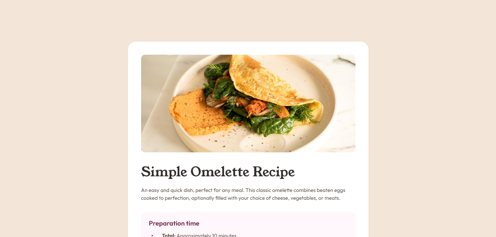

# Frontend Mentor - Recipe page solution

This is a solution to the [Recipe page challenge on Frontend Mentor](https://www.frontendmentor.io/challenges/recipe-page-KiTsR8QQKm). Frontend Mentor challenges help you improve your coding skills by building realistic projects.

## Table of contents

- [Overview](#overview)
  - [The challenge](#the-challenge)
  - [Screenshot](#screenshot)
  - [Links](#links)
- [My process](#my-process)
  - [Built with](#built-with)
  - [What I learned](#what-i-learned)
  - [Continued development](#continued-development)
  - [Useful resources](#useful-resources)
  - [AI collaboration](#ai-collaboration)
- [Author](#author)
- [Acknowledgments](#acknowledgments)

## Overview

### The challenge

Users should be able to:

- View the recipe page optimally on both mobile and desktop devices.
- See the layout that matches the provided design, including:
  - A hero image of the omelette.
  - Preparation time, ingredients, step-by-step instructions, and nutrition table.
- Experience a clean, semantic HTML structure with proper accessibility attributes.

### Screenshot



### Links

- Solution URL: [https://github.com/runny-life/recipe-page](https://github.com/runny-life/recipe-page)
- Live Site URL: [https://runny-life.github.io/recipe-page/](https://runny-life.github.io/recipe-page/)

## My process

### Built with

- Semantic HTML5 markup (`<main>`, `<article>`, `<section>`, `<dl>`)
- CSS custom properties (variables for colors and fonts)
- Flexbox (for layout and alignment)
- CSS Grid (for the nutrition table rows)
- Mobile-first workflow (media query for screens wider than 768px)
- BEM naming convention for CSS classes
- Responsive typography using `clamp()`
- Modular CSS with `@import` (separate files for base, components)

### What I learned

While building this project, I reinforced several key concepts:

1. **Using CSS counters for custom list numbering** – Instead of relying on default ordered list styles, I used `counter-reset` and `counter-increment` to style numbers with a dot and custom color.

   ```css
   ol {
     counter-reset: counter;
     list-style-type: none;
   }
   ol li::before {
     content: counter(counter, decimal) ".";
     counter-increment: counter;
     font-weight: 700;
     color: var(--brown-800);
   }
   ```

2. **Styling list markers with pseudo-elements** – For unordered lists, I replaced default bullets with custom round markers positioned absolutely for precise vertical alignment.

   ```css
   ul li::before {
     content: "";
     width: 0.25rem;
     height: 0.25rem;
     border-radius: 50%;
     background-color: var(--brown-800);
   }
   ```

3. **Fluid typography with `clamp()`** – The main heading scales smoothly between 2.25rem and 2.5rem without extra media queries, improving responsiveness.

4. **Component-based CSS architecture** – Separating styles into `base/` and `components/` folders using `@import` made the code more maintainable and scalable.

5. **Accessibility enhancements** – Added ARIA attributes (`aria-labelledby`, `aria-describedby`) to sections and used semantic elements to improve screen reader support.

### Continued development

Going forward, I want to focus on:

- Deepening my understanding of CSS Grid for more complex layouts.
- Integrating a CSS preprocessor (like Sass) for nested rules and mixins.
- Adding subtle animations (e.g., fade-in on scroll) for a polished user experience.
- Performing thorough accessibility audits with Lighthouse and screen readers.
- Optimizing font loading further (already using `font-display: swap`).

### Useful resources

- [MDN Web Docs: CSS Counter Styles](https://developer.mozilla.org/en-US/docs/Web/CSS/CSS_Counter_Styles) – Helped me implement custom ordered list numbering.
- [Can I Use: clamp()](https://caniuse.com/css-math-functions) – Verified browser support for the `clamp()` function.
- [Frontend Mentor Community](https://www.frontendmentor.io/community) – Gained inspiration from other solutions.
- [CSS Tricks: A Complete Guide to Flexbox](https://css-tricks.com/snippets/css/a-guide-to-flexbox/) – Quick reference for Flexbox properties.

### AI collaboration

I used an AI assistant (ChatGPT) during this project for:

- **Generating the README structure** – to quickly draft a complete documentation template.
- **Explaining CSS counters** – the AI provided clear examples and syntax.
- **Code refactoring** – helped consolidate repetitive styles and extract common patterns into base styles.

The AI was helpful for brainstorming and boilerplate, but all final design decisions and cross‑browser testing were done manually.

## Author

- GitHub – [@runny-life](https://github.com/runny-life)
- Frontend Mentor – [@runny-life](https://www.frontendmentor.io/profile/runny-life)

## Acknowledgments

Thanks to the Frontend Mentor community for providing high‑quality design challenges. Special thanks to the creators of the Outfit and Young Serif fonts for making the design look beautiful.
